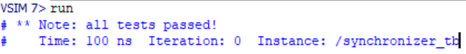
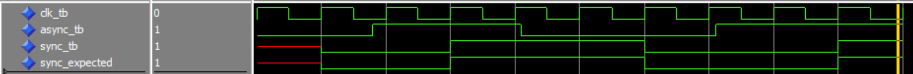

# Homework 3: Synchronizer VHDL
## Overview
The purpose of this project was to create a VHDL file which takes in an asynchronous signal, and synchronizes it to a clock using 2 D-flip-flops connected together.

## Deliverables

