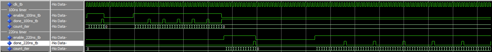
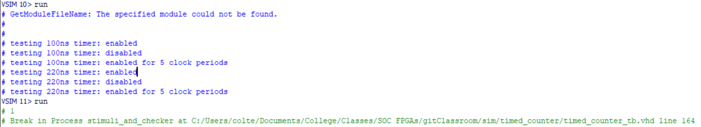

# Homework 4: Timed Counter

## Overview
This homework was about designing a timed counter in VHDL. This counter takes in a count time and an enable signal. When enabled, the timer counts for the desired time period, then pulses the "done" signal for one clock cycle. This will be used later for lab 4.

## Deliverables

