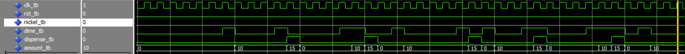
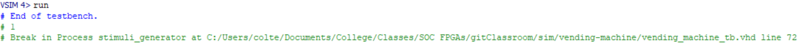

# Homework 5: Vending Machine

## Overview
This homework was about creating a simple state machine for a vending machine in VHDL. The vending machine takes in nickels and dimes, and tracks the amout of change entered. If this value reaches or exceeds 15, the vending machine leaves the value at 15 and asserts dispense for one clock period. It then resets back to zero.

## Deliverables

